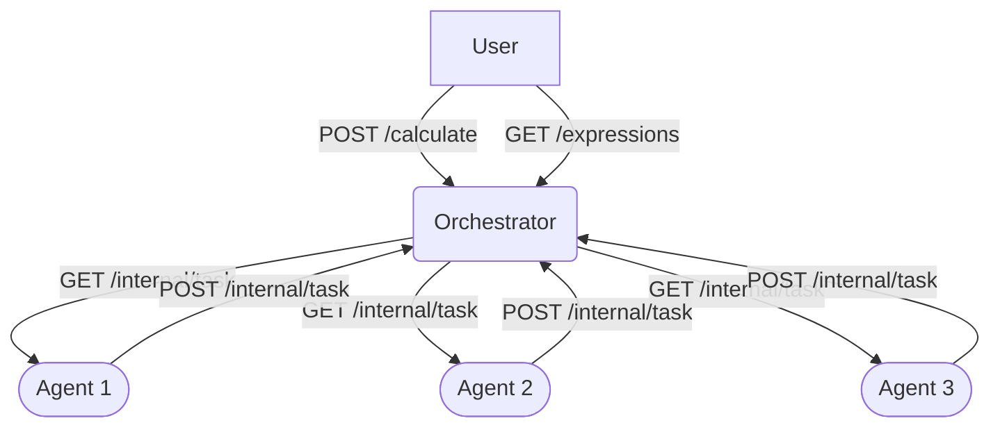

# 🧮 Simple Go Calculator

Welcome to the **Simple Go Calculator** repository! This project provides a straightforward calculator implementation in Go, allowing you to perform basic arithmetic operations either in a **console mode** or via a **server mode**. Choose the mode that best suits your needs! \
[доступно на русском](./docs/READMERUS.md)

### 🚀 **Features**

**Console Mode**: Run the calculator directly in your terminal for quick calculations.

**Server Mode**: Start a lightweight HTTP server to handle calculations via API requests.
Supports basic arithmetic operations: `+`, `-`, `*`, `/`.
Easy to use and extend.

### 🧱 Architecture



### 📦 **Installation**

To get started, make sure you have Go installed on your machine. You can download it from [here](https://golang.org/dl/).

Clone the repository:

```bash
git clone https://github.com/shzuzu/Go_Calculator.git
cd Go_Calculator
```

**Install dependencies:**
`go mod tidy`

### 🛠️ **Usage**

#### This creates a .env file with environment variables

1. **Console Mode**
   Run the calculator in your terminal for interactive calculations:

```bash
go run ./cmd/main.go --mode=console
```

Enter your arithmetic expressions directly in the terminal.
**Example:**

```
Input expression (enter "exit" to exit):
2+2*2
2+2*2 = 6
```

2. **Server Mode**
   Start the calculator as an HTTP server to handle calculations via API:

```bash
go run ./cmd/main.go --mode=server
```

The server will start on `http://localhost:8080/`.
Send a POST request with your expression to `/api/v1/calculate`:

```bash
 curl --location 'localhost:8080/api/v1/calculate' \
--header 'Content-Type: application/json' \
--data '{
  "expression": "2+2*2"
}'
```

**Example response 1:**

```json
{
  "id": 1
}
```

**Example request 2 `/expressions/{id}`:**

```bash
curl localhost:8080/api/v1/expressions/1
```

**Example response 2:**

```json
{
  "id": "1",
  "status": "done",
  "result": 6
}
```

- Several requests

```bash
 curl --location 'localhost:8080/api/v1/calculate' \
--header 'Content-Type: application/json' \
--data '{
  "expression": "2+2*1"
}'
```

```bash
curl localhost:8080/api/v1/expressions
```

- Responce:

```json
{
  "expressions": [
    {
      "id": "1",
      "status": "done",
      "result": 6
    },
    {
      "id": "2",
      "status": "done",
      "result": 4
    }
  ]
}
```

### 🚨 **Error Handling**

The server handles various error scenarios gracefully and returns appropriate HTTP status codes and messages. Below are the details of the errors you might encounter:

**❌422 Unprocessable Entity**

This error occurs when the provided expression is syntactically correct but cannot be processed.

**Example request 1:**

```bash
curl --location 'localhost:8080/api/v1/calculate' \
--header 'Content-Type: application/json' \
--data '{
  "expression": "313 / 0"
}'
```

**Example responce 1:**

```json
{
  "error": "Division by zero"
}
```

##

\
**Example request 2:**

```bash
curl localhost:8080/api/v1/expressions/1
```

**Example responce 2:**

```json
{
  "id": "1",
  "status": "error",
  "result": null
}
```

**❌500 Internal Server Error**

This error occurs when there is an unexpected issue on the server side, such as a bug in the code or an unhandled exception.

Example Response:

```json
{
  "error": "Internal server error"
}
```

**❌405 Method Not Allowed**

This error occurs when an unsupported HTTP method is used for a route. For example, using GET instead of POST for the `/api/v1/calculate` endpoint.

**Example Request:**

```bash
curl -X GET http://localhost:8080/calculate -d '{"expression": "2 + 2"}'

```

**Example Response:**

```json
{
  "error": "Method not allowed"
}
```

### 🧪 **Testing**

The project includes unit tests to ensure the calculator works as expected. Run the tests using:

```bash
go test ./internal/application
go test ./pkg/calc
```

### 📜 **License**

This project is licensed under the **MIT License**. See the [LICENSE](./LICENSE) file for details.

### 💬 **Feedback**

If you have any questions, suggestions, or issues, feel free to open an issue or reach out to me directly.

**Happy calculating!** 🎉

\
\
This is the end, fren..

BTW, THE CAT ↓

```

                   _ |\_
                   \` ..\
              __,.-" =__Y=
            ."        )
      _    /   ,    \/\_
     ((____|    )_-\ \_-`
     `-----'`-----` `--`

```
