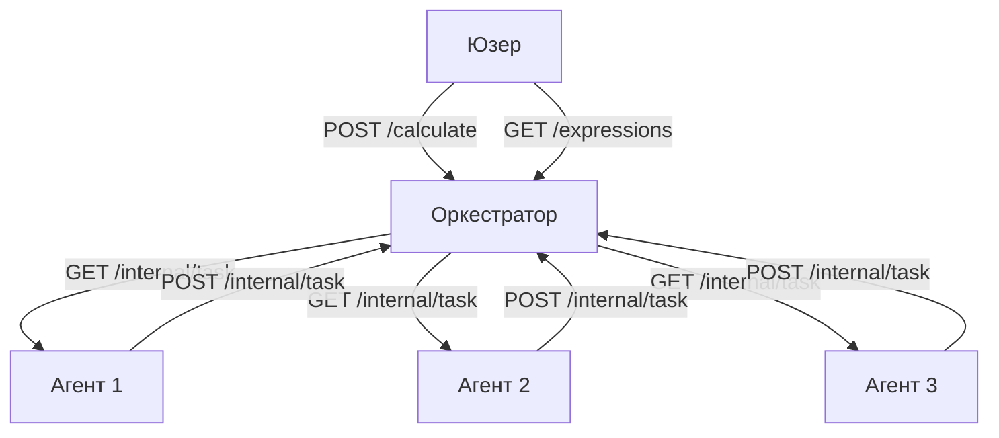

# 🧮 **Простой калькулятор на Go**

Добро пожаловать в репозиторий **Простого калькулятора на Go**! Этот проект представляет собой простую реализацию калькулятора на Go, позволяющую выполнять базовые арифметические операции как в **консольном режиме**, так и через **режим сервера**!\
Выберите режим, который лучше всего подходит для ваших нужд!

### 🚀Возможности

**Консольный режим**: Запускайте калькулятор прямо в терминале для быстрых вычислений.\
**Серверный режим**: Запустите легковесный HTTP-сервер для обработки вычислений через API-запросы. Поддерживает базовые арифметические операции: `+`, `-`, `*`, `/`. Прост в использовании и расширении.

### 🧱 Архитектура



### 📦 **Установка**

Для начала убедитесь, что на вашем компьютере установлен Go. Вы можете скачать его [здесь](https://golang.org/dl/).\
Клонируйте репозиторий:

```bash
git clone https://github.com/shzuzu/Go_Calculator.git
cd Go_Calculator
```

### 🛠️ **Использование**

**Консольный режим**\
Запустите калькулятор в терминале для интерактивных вычислений:

```bash
go run ./cmd/main.go --mode=console
```

Вводите арифметические выражения прямо в терминал.\
**Пример:**

```
Input expression (enter "exit" to exit): 2+2*2
2+2*2 = 6
```

**Серверный режим**\
Запустите калькулятор как HTTP-сервер для обработки вычислений через API:

```bash
go run ./cmd/main.go --mode=server
```

Сервер запустится по адресу `http://localhost:8080\`. Отправьте POST-запрос с вашим выражением на `/api/v1/calculate`:

```bash
curl --location 'localhost:8080/api/v1/calculate'
--header 'Content-Type: application/json'
--data '{ "expression": "2+2*2" }'
```

**Пример ответа 1:**

```json
{
  "id": 1
}
```

**Пример запроса 2 `/extensions/{id}`:**

```bash
curl localhost:8080/api/v1/expressions/1
```

**Пример ответа 2:**

```json
{
  "id": "1",
  "status": "done",
  "result": 6
}
```

##

- Несколько запросов

```bash
 curl --location 'localhost:8080/api/v1/calculate' \
--header 'Content-Type: application/json' \
--data '{
  "expression": "2+2*1"
}'
```

```bash
curl localhost:8080/api/v1/expressions/
```

- Ответ:

```json
{
  "expressions": [
    {
      "id": "1",
      "status": "done",
      "result": 6
    },
    {
      "id": "2",
      "status": "done",
      "result": 4
    }
  ]
}
```

### 🚨 **Обработка ошибок**

Сервер корректно обрабатывает различные сценарии ошибок и возвращает соответствующие HTTP-коды состояния и сообщения. Ниже приведены детали ошибок, с которыми вы можете столкнуться:

**❌422 Unprocessable Entity**

Эта ошибка возникает, когда предоставленное выражение синтаксически правильное, но не может быть обработано.

**Пример запроса 1:**

```bash
curl --location 'localhost:8080/api/v1/calculate'
--header 'Content-Type: application/json'
--data '{
"expression": "313 / 0"
}'
```

**Пример ответа 1:**

```json
{
  "error": "Division by zero"
}
```

##

**Пример запроса 2:**

```bash
curl localhost:8080/api/v1/expressions/1
```

**Пример ответа 2:**

```json
{
  "id": "1",
  "status": "error",
  "result": null
}
```

**❌500 Internal Server Error**

Эта ошибка возникает при непредвиденной проблеме на стороне сервера, например, при ошибке в коде или необработанном исключении.

**Пример ответа:**

```json
{
  "error": "Internal Server Error"
}
```

**❌405 Method not allowed**

Эта ошибка возникает при использовании неподдерживаемого HTTP-метода для маршрута. Например, при использовании GET вместо POST для endpoint'a `/api/v1/calculate`.

**Пример запроса:**

```bash
curl -X GET http://localhost:8080/calculate -d '{"expression": "2 + 2"}'
```

**Пример ответа:**

```json
{
  "error": "Method not allowed"
}
```

### 🧪 **Тестирование**

Проект включает модульные тесты для проверки правильности работы калькулятора. Запустите тесты с помощью:

```bash
go test ./internal/application
go test ./pkg/calc
```

### 📜 **Лицензия**

Этот проект лицензирован под **MIT License**. Смотрите файл [LICENSE](./LICENSE) для получения подробной информации.

### 💬 **Обратная связь**

Если у вас есть вопросы, предложения или проблемы, не стесняйтесь открывать issue или обращаться ко мне напрямую.
\
\
**Удачи в использовании!** 🎉
\
\
КОТ ↓

```

                   _ |\_
                   \` ..\
              __,.-" =__Y=
            ."        )
      _    /   ,    \/\_
     ((____|    )_-\ \_-`
     `-----'`-----` `--`

```
